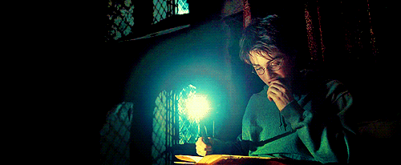

# Electrical Intuition

## Intuition

. . .

> a natural ability or power that makes it possible to know something without any proof or evidence
>
> Merriam-Webster Dictionary

## Gameplan

> - Quickly identify dangerous situations
> - Avoid obvious mistakes in circuit design
> - Talk intelligently about electricity
> - Conductors, Capacitors and Resistors

item 3 is especially important for MechE's

## Electricity is Magic

> - Tiny, little "beads" that move around in only certain things
> - Can do all sorts of crazy stuff, like Calculators
> - We actually have no idea why it works

. . .

- Tiny, little "beads" that move around in only certain things
- Can do all sorts of crazy stuff, like Calculators
- We actually have no idea why it works

Fun Thing: Do "Okay Google turn on the flashlight" to show that we can do magic as well! (Note: I don't actually know if this works)

Purpose: Electricity and electronics are hard. It is okay to not get things on the first try, and sometimes you just have to believe for now. The key is to just keep working at it. Nobody is born understanding electricity

# Voltage

## What is Voltage?

. . .

> Electric potential difference between two points.
>
> Wikipedia

Ask what people know about voltage. Try to get Ohm's Law as an answer, or something. They have a few days in Isim already, they should be experts.

Purpose: Get people talking, make everyone comfortable just putting out ideas. This is an open presentation, not a lecture

## Dangers of Voltage

> - Can Voltage kill you?
> - Is high voltage dangerous?

- Can Voltage kill you? (NO)
- Is high voltage dangerous? (YES)

Purpose: Bring up current and how it relates to voltage. Also brings in some intuition

---------

# Current

## What is Current?

. . .

> An electric current is a flow of electric charge. 
>
> Wikipedia

Try to get a bunch of different answers. Ask about how it might be related to voltage. (I sure do hope they go to Ohm's law by this point)

## Dangers of Current

> - Can Current kill you?
> - Is high current dangerous?

- Can Current kill you? (YES)
- Is high current dangerous? (Well, YES)

The second question is interesting because it raises a good question about what it means to be dangerous. Hopefully I have those fat capacitors with me at this point, and I can explain things with it.

Purpose: Have a discussion about danger

# Ohm's Law

## V = I R

V is Voltage

I is Current

R is *Resistance*

Ask what this law means and implies. Discuss what "resistance" is.

# Feedback

## Help Make This Better!

[http://tinyurl.com/formula-tutorial-feedback](https://goo.gl/forms/Q8JvF5ppO3JeT7h73)

