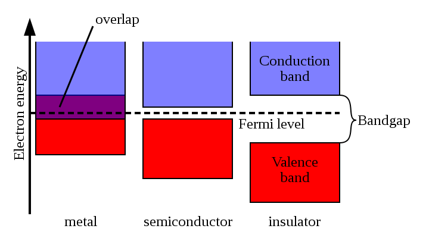
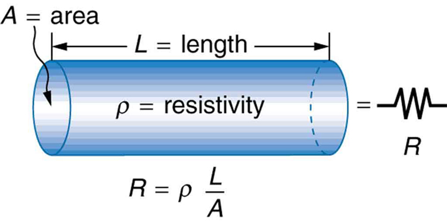
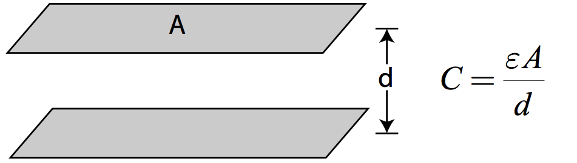
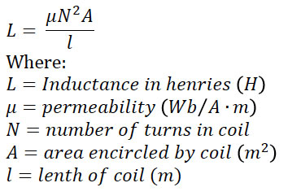

# Looking Back

## Questions From Last Time
> - How much background experience is required to be helpful?
> - How to do Frequency Analysis/Finding a transfer function
> - Why does the Inductor act as a low-pass filter in the intuitive model?
> - Why does the Capacitor have .5V on one side?

- How much background experience is required to be helpful?
None. However, we do expect you to learn. 

- How to do Frequency Analysis/Finding a transfer function
Take SigSys if you are really interested. I can possibly do a talk later
out how to do this, but it is slightly out of the scope of these tutorials.

- Why does the Inductor act as a low-pass filter in the intuitive model?
A slow wire acts like a wire for low frequencies, and acts like an open
rcuit for higher frequencies.

- Why does the Capacitor have .5V on one side?
I lied. It doesn't. LTSpice also lied to me. Don't trust anyone.

# Basic Components in Electronics

## The Big Four

> - Wire
> - Resistor
> - Capacitor
> - Inductor

## Relations

- A wire is a *conductor*
- A resistor is a bad wire
- A Capacitor is a slow, super-resistor
- An Inductor is a slow wire

# Conductors, Non-Conductors and the In-Between

## A Conductor

> a conductor is an object or type of material that allows the flow of an electrical current in one or more directions
>
> Wikipedia

## Fermi Levels

## How Resistance Relates

# Capacitors In A New Light

## A Bridge Between Worlds

epsilon is the permitivity of free space, but could also be the permitivity of
an insulation material

Basically a conductor, non-conductor sandwich

## How They Work

> - As current flows, charge builds up on both sides
> - This charge creates an electric field at the center, where energy is stored
> - When disconnected, that electric field remains stable
> - Discharge extremely quickly

# Inductors

## Just Wires

## How They Work

> - As current flows some magic happens
> - A magnetic field is generated (?) in the center which stores energy (?)
> - When disconnected... Uh...
> - ...

## Why Inductors Suck

The exact reason is that an inductor can be defined by `L = dB_flux/di` 
where `B_flux` is the magnetic flux and `i` is instantaneous current. 

`L` is a constant, so when you "turn off" and inductor, you essentially make the `di` absolutely massive (going from some current to no current, which if thought to be instant would mean an infinite di). 

Thus the `B_flux` would have to be massive in order to counter-act the large `di` term. A large change in `B_flux` thus generates a massive Emf due to Faraday's law

Emf = - `dB_flux/dt`

# A Look Ahead

## The New Kid

> - Transistors and Other Semiconductor nonsense
> - Basic semiconductor circuits, including:
> - Half-bridge Rectifier
> - Full-bridge Rectifier
> - Half-bridge Driver
> - Full-bridge Driver

# Questions

# Feedback

## Help Make This Better!

[http://tinyurl.com/formula-tutorial-feedback](https://goo.gl/forms/Q8JvF5ppO3JeT7h73)

